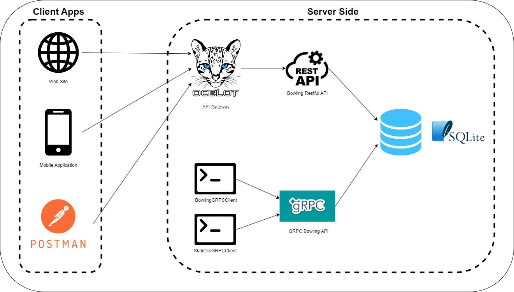

# Architecture diagram of Bowling Scorer API

## Description

The project is divided into two main parts, with the server side on the right and the client side on the left. The different types of APIs in the BowlingScorerAPI are exposed through the API Gateway component, which is built with Ocelot. The main advantage of this design is to prevent direct communication between cients and the back-end of the project, as well as to provide the ability to create multiple gateways to cater to different client types. For example, a separate gateway could be created specifically for mobile applications, or just for common web sites, allowing the implementation of the Back-end for Front-end (BFF) pattern.

In the server side, there are two APIs available, including a Restful API and a GRPC API, each with complete CRUD operations on Players and Statistics. These two APIs are connected to the same database, which is a SQLite database, providing a convenient and centralized storage solution.

By utilizing the API Gateway component, it becomes possible t better control and manage access to the APIs, and to easily apply different policies and rules for different client types. This can help to improve the overall security and reliability of the system, as well as to enhance the scalability and flexibility of the solution.

In addition, the use of two APIs (Restful and GRPC) provides more opions for clients to interact with the back-end, offering the best of both worlds in terms of performance, ease of use, and compatibility. This allows developers to choose the most appropriate API for their specific needs, based on factors such as the nature of the data being transmitted, the desired level of performance, and the preferred programming language / development platform.

Furthermore, the choice of SQLite as the database provides a number of advantages as well. SQLite is a lightweight, file-based database that is easy to set up, manage, and maintain, while still providing robust and reliable data storage capabilities. This makes it an ideal choice for small to medium-sized projects, where the complexity and cost of a more sophisticated database solution would be unnecessary or unwarranted.

Overall, the design of the project, with the API Gateway component, the use of both Restful and GRPC APIs, and the choice of SQLite as the dataase, provides a flexible, scalable, and efficient solution for building and deploing modern web services. This design is well-suited to meet the demands of a wide range of applications, from simple web-based systems, to complex, multi-tier solutions.

