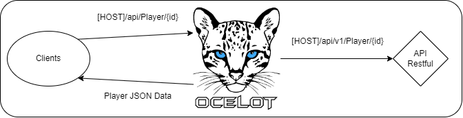

# API Gateway description

  

### API Gateway Description Diagram
---
## What is a API Gateway ?
A API Gateway is a technology that enable us to create a separation between clients and our microservices. The gateway expose our services by taking a request and translate it for the microservices (as we can see on the diagram at the top). There is multiple adventages to this type of architecture : 

* Firstly, Api Gateway avoid to have a direct connexion between client and micro-services, so it is a way to protect our microservices for external attacks.

* Secondly, we can create one API Gateway disigned for each type of client (BFF Patern : Back-end for Front-end), for example, one for mobile client, one for web site client, ...

But this architecture has some weakness, for example, if the APi Gateway fall, everything falls. In addition, this architecture add some response time because a request send from an external client need to be processed by the gateway before sent to the micro-services.

## Our API Gateway
The Api Gateway is made with Ocelot. 

It works with upstream or downstream request. Upstream request are received from the client, then, the upstream request is converted to a downstream request to talk with the microservices behind the gateway. For example, the request **[HOST]/api/Player/{id}** is translated to **[HOST]/api/v1/Player/{id}**.

