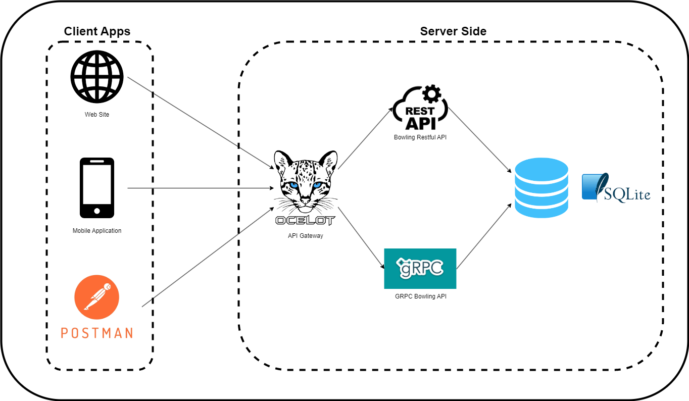

# Architecture diagram of Bowling Scorer API

## Description

The project is divided into two main part, on the right, we can see the server side and on the left, we can see the client side.   

The differents types of APIs of BowlingScorerAPI are exposed thanks to the API Gateway component. 
This component is made with Ocelot, the main interest of this conception is to avoid a direct communication between clients and back-end of the project. 
In addition, we can create multiple gateways to fit to the different client types. 
For example we could create a gateway just for the mobile applications or just for common web sites. 
Thanks to this component, we can apply the pattern BFF (Back-end for Front-end) to our project.  

In the server side, we can found 2 APIs, the first is a Restful API and the second is a GRPC API. These 2 APIs have all CRUD operations on Players and Statistics. They are connected to the same database, a sqlite database.

